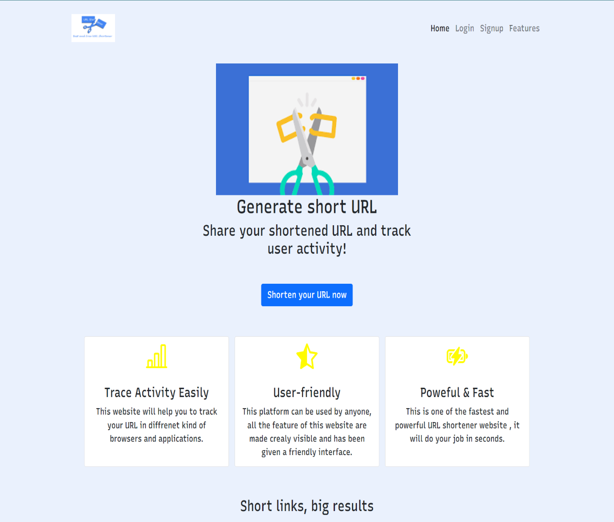
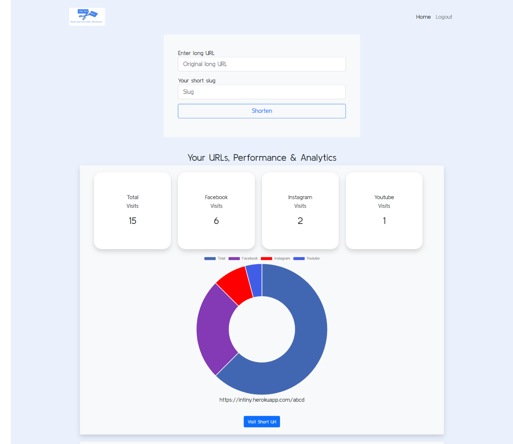

https://user-images.githubusercontent.com/66771124/146844620-4c117234-d569-4bc6-9aa0-34eacaf02914.mp4

# Intiny - A Short URL Service In Node JS With Data Visualization

This repo contains code for a Short URl Service Coded In NODE JS !

## 1. USAGE
This is an online URL shortener platform made by Ayush Kumar, Sourish Pal and Gaurav Kumar as the final project of Walkover University Program.
The web application a robust online testing platform for shortening URLs. The project is made over Node.js as backend, MongoDB as the  database, and HTML, CSS, JS, Boostrap4, and AJAX as frontend.

A deployed version can be checked here: https://intiny.herokuapp.com/

## We worked for the following specifications
1. User can login via Email or google account.✔️
2. Every shortened URL is unique.✔️
3. User can see the total number of clicks and also number of clicks via fb, insta and youtube.✔️
4. User can also see the analytics through a pie chart;✔️
5. All the user's short URLs and analytics are stored and can be accssed later via login.✔️

## Additional Features
1. Great UI.
2. Completely responsive for all devices.
3. Login page for storing user's shortened URLs and the analytics.
4. Users can track the number of clicks through fb, insta and youtube.
5. Every URL is unique to identify.
6. Users can see the number of clickts through an UI featuring a chart.

## Developers
1. Ayush Kumar [https://github.com/ayushkumar6669]
2. Sourish Pal [https://github.com/sourishpal2031]
3. Gaurav Kumar [https://github.com/gaurav7070]

* `Frontend + JavaScript Functionality` : ***Gaurav Kumar***
* `Database + Backend` : ***Sourish Pal***
* `Backend + Deployment` : ***Ayush Kumar***

## Tech Stack Used
1. `Frontend` : HTML5, CSS3, Javascript, Bootstrap, AJAX
2. `Backend` : Node.js
3. `Database` : MongoDB

## Deployment
For Deployment, we have used `Heroku` as a platform.

# Project Setup
### Install All Packages
```bash
npm install express ejs mongoose bcryptjs connect-flash cookie-parser express-session csurf memorystore passport passport-local passport-google-oauth20 nodemailer
```
### Install Nodemon For Development

```bash
npm install -D nodemon
```
Now just RUN the Project.
If everything is done in order then this will open the website in your local machine (port: 8000).

### CI/CD setup
1. Create a GitHub repository. You may initialize it with a README, license, .gitignore
2. Install git via terminal 

   (On Ubuntu you can do `sudo apt-get install git`)
3. Then do a git clone of your repository, or simply download the zip file of your repository from GitHub and extract it.
4. Copy your project in the new folder created after cloning (its name will be same to that of the repository you cloned).
5. Add all the changes you want.
6. Then execute these commands:
   
   ````
   git add . 

   git commit -m "[mandatory commit message]" 
   
   git push [url to your repository] master/main 
7. Now your commit will be successfully pushed to the main branch of your GitHub repository.
8. The changes will automatically be deployed in the web application.





